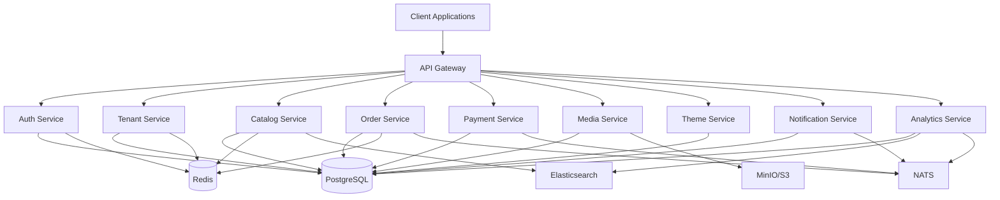

# MCOM eCommerce SaaS Backend

[](https://github.com/mcom/mcom-api/actions)
[](https://codecov.io/gh/mcom/mcom-api)
[](https://opensource.org/licenses/MIT)

A scalable, multi-tenant eCommerce SaaS platform inspired by Shopify's architecture. Built with NestJS, PostgreSQL, and designed for blazing-fast performance with developer-friendly extensibility.

## 🚀 Quick Start

### Prerequisites

- **Node.js** >= 18.0.0
- **pnpm** >= 8.0.0  
- **Docker** >= 20.0.0
- **PostgreSQL** >= 13.0.0
- **Redis** >= 6.0.0

### Installation

```bash
# Clone the repository
git clone https://github.com/mcom/mcom-api.git
cd mcom-api

# Install dependencies
pnpm install

# Setup environment
cp .env.example .env

# Start infrastructure services
pnpm run docker:up

# Run database migrations
pnpm run migrate:up

# Seed initial data
pnpm run seed

# Start development servers
pnpm run dev
```

### 🌐 Service URLs

Once started, the following services will be available:

| Service | URL | Description |
|---------|-----|-------------|
| 🌐 API Gateway | http://localhost:3000 | Main API entry point |
| 🔐 Auth Service | http://localhost:3001 | Authentication & authorization |
| 🏪 Tenant Service | http://localhost:3002 | Multi-tenant management |
| 📦 Catalog Service | http://localhost:3003 | Products & inventory |
| 🛒 Order Service | http://localhost:3004 | Order processing |
| 💳 Payment Service | http://localhost:3005 | Payment processing |
| 📁 Media Service | http://localhost:3006 | File uploads & CDN |
| 🎨 Theme Service | http://localhost:3007 | Store customization |
| 📧 Notification Service | http://localhost:3008 | Notifications |
| 📊 Analytics Service | http://localhost:3009 | Metrics & reporting |

### 📚 Documentation

- **API Documentation**: http://localhost:3000/api/docs (Swagger UI)
- **Health Checks**: http://localhost:3000/health
- **Metrics**: http://localhost:9090 (Prometheus)
- **Monitoring**: http://localhost:3010 (Grafana)

## 🏛️ Architecture

### Microservices Architecture



### Multi-Tenancy Strategy

- **Row-Level Security**: Each table includes `tenant_id` for data isolation
- **Tenant Resolution**: Domain/subdomain-based tenant identification  
- **Data Isolation**: Automatic tenant context injection in all queries
- **Schema Flexibility**: JSON columns for tenant-specific configurations

## 🛠️ Development

### Available Scripts

```bash
# Development
pnpm run dev                    # Start all services in development mode
pnpm run dev:gateway           # Start API Gateway only
pnpm run dev:auth              # Start Auth Service only

# Building
pnpm run build                 # Build all services
pnpm run build:libs           # Build shared libraries only
pnpm run build:apps           # Build applications only

# Testing  
pnpm run test                  # Run unit tests
pnpm run test:e2e             # Run end-to-end tests
pnpm run test:cov             # Run tests with coverage

# Database
pnpm run migrate:up           # Run migrations
pnpm run migrate:down         # Rollback migrations
pnpm run seed                 # Seed database with sample data

# Docker
pnpm run docker:up            # Start infrastructure services
pnpm run docker:down          # Stop infrastructure services
pnpm run docker:logs          # View service logs

# Code Quality
pnpm run lint                 # Run ESLint
pnpm run format               # Format code with Prettier
```

### Project Structure

```
mcom-api/
├── 📁 apps/                   # Microservices applications
│   ├── 📁 api-gateway/        # Main API Gateway
│   ├── 📁 auth-service/       # Authentication service
│   ├── 📁 tenant-service/     # Multi-tenancy management
│   ├── 📁 catalog-service/    # Product catalog
│   ├── 📁 order-service/      # Order processing
│   ├── 📁 payment-service/    # Payment processing
│   ├── 📁 media-service/      # File uploads & CDN
│   ├── 📁 theme-service/      # Store themes
│   ├── 📁 notification-service/ # Notifications
│   └── 📁 analytics-service/  # Analytics & reporting
│
├── 📁 libs/                   # Shared libraries
│   ├── 📁 common/             # Common utilities
│   ├── 📁 database/           # Database configs & entities
│   ├── 📁 messaging/          # Event bus & messaging
│   ├── 📁 types/              # Shared TypeScript types
│   ├── 📁 auth/               # Authentication utilities
│   ├── 📁 cache/              # Caching utilities
│   └── 📁 validation/         # Validation schemas
│
├── 📁 infra/                  # Infrastructure as Code
│   ├── 📁 docker/             # Docker configurations
│   ├── 📁 kubernetes/         # Kubernetes manifests
│   ├── 📁 terraform/          # Cloud infrastructure
│   └── 📁 monitoring/         # Monitoring configs
│
├── 📁 config/                 # Application configurations
├── 📁 docs/                   # Documentation
├── 📁 tests/                  # Integration & E2E tests
└── 📁 scripts/                # Development scripts
```

## 🔧 Technology Stack

- **Runtime**: Node.js with TypeScript
- **Framework**: NestJS with Fastify adapter
- **Database**: PostgreSQL 15+ with TypeORM
- **Caching**: Redis 7+
- **Search**: Elasticsearch
- **Message Queue**: NATS Streaming
- **File Storage**: S3-compatible (MinIO, AWS S3)
- **Monitoring**: Prometheus + Grafana
- **Documentation**: OpenAPI 3.0 (Swagger)

## 🚀 Deployment

### Docker Compose (Development)

```bash
# Start all services
pnpm run docker:up

# View logs
pnpm run docker:logs

# Stop services
pnpm run docker:down
```

### Kubernetes (Production)

```bash
# Deploy to development
pnpm run k8s:apply

# Delete deployment  
pnpm run k8s:delete
```

### Infrastructure

The project includes Terraform modules for AWS deployment:

- **VPC** with public/private subnets
- **RDS PostgreSQL** with read replicas
- **ElastiCache Redis** cluster
- **EKS** Kubernetes cluster
- **S3** buckets for file storage
- **CloudFront** CDN distribution

## 🧪 Testing

### Test Strategy

- **Unit Tests** (80%): Jest with >90% coverage requirement
- **Integration Tests** (15%): Service-to-service communication  
- **E2E Tests** (5%): Full user journey testing

### Running Tests

```bash
# Unit tests
pnpm run test

# Integration tests  
pnpm run test:integration

# E2E tests
pnpm run test:e2e

# Load tests
pnpm run test:load

# Coverage report
pnpm run test:cov
```

## 📊 Monitoring & Observability

### Key Metrics

- **Business Metrics**: Revenue, conversion rates, cart abandonment
- **Technical Metrics**: Response times, error rates, throughput  
- **Infrastructure Metrics**: CPU, memory, disk, network usage

### Dashboards

- **Prometheus**: http://localhost:9090 - Metrics collection
- **Grafana**: http://localhost:3010 - Monitoring dashboards
- **Jaeger**: Distributed tracing (when enabled)

## 🔒 Security

### Authentication & Authorization

- **JWT** with refresh tokens
- **RBAC** (Role-Based Access Control)
- **Multi-factor authentication** support
- **API key management**

### Data Protection

- **Encryption**: AES-256 for data at rest, TLS 1.3 in transit
- **GDPR/CCPA** compliant data processing
- **Audit logs** for all operations
- **Rate limiting** and DDoS protection

## 🤝 Contributing

We welcome contributions! Please see our [Contributing Guide](./CONTRIBUTING.md) for details.

### Development Workflow

1. Fork the repository
2. Create a feature branch (`git checkout -b feature/amazing-feature`)  
3. Commit your changes (`git commit -m 'Add some amazing feature'`)
4. Push to the branch (`git push origin feature/amazing-feature`)
5. Open a Pull Request

### Code Standards

- **ESLint** for code linting
- **Prettier** for code formatting  
- **Jest** for testing
- **Conventional Commits** for commit messages
- **Husky** for git hooks

## 📄 License

This project is licensed under the MIT License - see the [LICENSE](LICENSE) file for details.

## 🙏 Acknowledgments

- Inspired by [Shopify's architecture](https://shopify.engineering/)
- Built with [NestJS](https://nestjs.com/) framework
- UI components from [Ant Design](https://ant.design/)
- Icons from [Heroicons](https://heroicons.com/)

---

**Built with ❤️ for the next generation of eCommerce platforms**